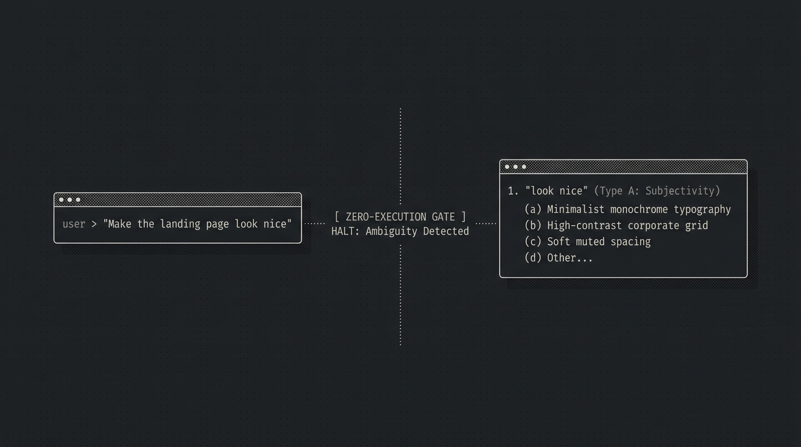

<p align="center">
  
</p>

<h1 align="center">Disambiguator</h1>

<p align="center">
A zero-dependency, pure instruction system prompt that intercepts ambiguous user instructions <strong>before any action is taken</strong>, surfaces assumptions as actionable multiple-choice options, and prevents wasted tokens and unintended code changes.
</p>

---

## Why Disambiguator?

AI coding assistants frequently rush into execution when handed vague instructions like *"make the UI look nice"* or *"refactor the backend"*. This leads to:
- Wasted tokens rewriting files you didn't want touched
- Hallucinated styling and unaligned architectural patterns
- Silent drift and destructive unintended edits

**Disambiguator acts as a zero-execution gatekeeper**: it halts the model before any tool execution, groups ambiguities by category, and generates realistic **multiple-choice suggestions (a/b/c/d)** so you can answer with just a letter instead of writing essays.

---

## Operating Modes

| Mode | Type A (Subjectivity) | Type B (Scope) | Type C (Context Assumptions) |
|---|---|---|---|
| **`strict` (Default)** | Always halts | Always halts | Always halts |
| **`soft`** | Always halts | Halts only on high-risk/destructive actions | Assumes safest standard, notes assumption, and proceeds |

### Switching Modes at Runtime
You can switch modes on the fly in any agent conversation, terminal harness, or IDE without editing files:
- Run `/disambiguator soft` to switch to soft mode.
- Run `/disambiguator strict` to switch back to strict mode.
- Run `/disambiguator off` to temporarily disable Disambiguator.
- Run `/disambiguator status` to check the active mode.

In IDEs and skill-based agents (Cursor, Windsurf, Copilot, Antigravity, etc.), you can also pick dedicated skills directly from autocomplete:
- `/disambiguator-strict`: Instantly sets strict mode.
- `/disambiguator-soft`: Instantly sets soft mode.
- `/disambiguator-off`: Instantly disables gatekeeper.
- `/disambiguator-status`: Displays the current active mode.

To change the permanent repository default, configure the top of [`system-prompt.md`](./system-prompt.md) and run `npm run sync`:
```markdown
# CONFIGURATION
# MODE: strict   <--- Change to "soft" to reduce interruptions
```

---

## Install

The most effort Disambiguator will ever ask of you:

### Claude Code
```
/plugin marketplace add agmonetti/disambiguator
/plugin install disambiguator@disambiguator
```
*(You have to send two separate prompts for the install to work)*

Same steps in the Claude Code Desktop app's Code tab: type the two `/plugin` commands above into the prompt box, or click the **+** button next to it, choose **Plugins** → **Add plugin** to browse your configured marketplaces, and manage marketplaces from **Customize** in the sidebar.

### Codex
```bash
codex plugin marketplace add agmonetti/disambiguator
codex plugin add disambiguator@disambiguator
```
Restart Codex or start a new thread to load the plugin. Covers both the Codex CLI and Codex desktop app.

### GitHub Copilot CLI
```bash
copilot plugin marketplace add agmonetti/disambiguator
copilot plugin install disambiguator@disambiguator
```
In an interactive Copilot CLI session, use the slash equivalents:
```
/plugin marketplace add agmonetti/disambiguator
/plugin install disambiguator@disambiguator
```

### Antigravity CLI (agy) & Gemini CLI
```bash
agy plugin install https://github.com/agmonetti/disambiguator
```
*(On legacy Gemini CLI: `gemini extensions install https://github.com/agmonetti/disambiguator`).*

Disambiguator provides native, first-class Antigravity support:
- **Zero-Token Runtime Mode Switcher**: Toggle operational modes instantly in 0 ms without burning conversational tokens:
  ```bash
  npx @agmonetti/disambiguator strict   # Enforce strict mode across ambiguities
  npx @agmonetti/disambiguator soft     # Set soft mode (assume safest for Type C)
  npx @agmonetti/disambiguator off      # Temporarily disable Disambiguator
  npx @agmonetti/disambiguator status   # View active mode
  ```
  *(Note: `@agmonetti/disambiguator` will be published to the public npm registry alongside the v1.0.0 release).*
- **Antigravity Lifecycle Hook (`hooks.json`)**: Listens on `PreInvocation`, tracks slash commands (`/disambiguator strict|soft|off`), persists the active mode to user config (`~/.config/disambiguator/mode` without repo pollution), and dynamically injects the active mode as an ephemeral system note before each agent turn.
- **Native Workspace Rules (`.agents/rules/disambiguator.md`)**: Automatically loaded by Antigravity CLI and IDE as an always-on cognitive gatekeeper with zero setup when working in a cloned repository.
- **Marketplace Distribution**: Manifested in `.agents/plugins/marketplace.json` for seamless Antigravity plugin marketplace discovery.

### Qoder
Qoder auto-loads `AGENTS.md` from the repo root as always-on context, so running Disambiguator from a checkout works with zero setup. For per-project rules, copy `AGENTS.md` into `.qoder/rules/disambiguator.md`. The gatekeeper skill is also accessible via Qoder's skill system from `skills/disambiguator/SKILL.md`.

### Universal Agent Skills (`skills.sh` / `npx skills`)
Works across 70+ AI coding agents automatically (Antigravity, Cursor, Claude Code, GitHub Copilot, Cline, Windsurf, etc.):
```bash
npx skills add agmonetti/disambiguator
```
To install globally across all workspaces on your machine:
```bash
npx skills add agmonetti/disambiguator -g
```

### Pi Agent Harness
```bash
pi install git:github.com/agmonetti/disambiguator
```
*(Or if running locally: `pi -e ./pi-extension/index.js`).*

#### Why does Disambiguator include `pi-extension/`?
Disambiguator remains a **zero-dependency, pure instruction prompt** for standard environments (Cursor, Windsurf, Claude Code, Copilot, Cline, etc. only consume Markdown rules and skills without running any JS).

However, the **Pi Agent Harness** supports an optional extension architecture (`pi-extension/index.js`). Disambiguator leverages this official pattern to provide:
- **First-Class Slash Command**: Direct `/disambiguator` command instead of `/skill:disambiguator`.
- **Interactive Argument Autocomplete**: Typing `/disambiguator ` invokes `getArgumentCompletions` to show `strict`, `soft`, and `status` in Pi's terminal dropdown.
- **Zero-Token Runtime Toggles**: Switching modes executes locally in 0 ms without sending conversational prompts or burning LLM tokens.
- **Dual-Tier State Persistence**: Automatically persists mode switches across both the Pi session journal (`appendEntry`) and machine user config (`~/.config/disambiguator/mode`), ensuring cross-harness state parity with Antigravity and the CLI without creating untracked files in user repositories.
- **Terminal Status Bar**: Displays the live mode (`● disambiguator: STRICT` / `SOFT`) in the terminal footer.
- **Dynamic Prompt Hook**: Injects or updates the active mode directly on each turn via Pi's `before_agent_start` event.

### OpenCode
Add to `opencode.json`:
```json
{ "plugin": ["@agmonetti/disambiguator"] }
```
Or run directly from a local repository checkout:
```json
{ "plugin": ["./.opencode/plugins/disambiguator.mjs"] }
```
The plugin:
- Injects the Disambiguator cognitive gatekeeper into every chat's system prompt on every turn at the active mode (`strict` or `soft`).
- Automatically registers the full skills catalog (`disambiguator`, `disambiguator-strict`, `disambiguator-soft`) in OpenCode (`config.skills.paths`).
- Exposes native slash commands: `/disambiguator [strict|soft|status|off]` and `/disambiguator-help` (quick reference card).
- Persists mode changes across sessions in `~/.config/opencode/.disambiguator-active`.
OpenCode also auto-loads this repo's `AGENTS.md` with zero configuration when cloned.

### Devin CLI
```bash
devin plugins install agmonetti/disambiguator
```

### Hermes Agent
```bash
hermes plugins install agmonetti/disambiguator --enable
```

### Swival
```bash
swival skills add --global https://github.com/agmonetti/disambiguator
swival skills add disambiguator
```

### OpenClaw
```bash
clawhub install disambiguator
```
*(Without ClawHub: copy `skills/disambiguator/SKILL.md` into `~/.openclaw/skills/disambiguator/`)*.

---

### Zero-Setup Universal Context (`AGENTS.md`)
The following agents automatically discover and load `AGENTS.md` from your repository root with **zero setup required**:
- **Amp** (Sourcegraph)
- **Jules** (Google)
- **JetBrains Junie** (Settings → Tools → Junie → Project Settings → Guidelines Path)
- **VS Code with Codex extension**
- **CodeWhale, Aider, Zed, Qoder**

Just clone this repository or drop `AGENTS.md` into your project root.

---

### Instruction-Only / Editor Rules (Copy & Paste)
For editor environments that read dedicated rule directories, copy the matching rule file from this repo:

| Editor / Environment | Target Path in Your Project | Global Path |
|---|---|---|
| **Cursor** | `.cursor/rules/disambiguator.mdc` | — |
| **Codeium Windsurf** | `.windsurf/rules/disambiguator.md` | — |
| **Cline / Roo-Code** | `.clinerules` | — |
| **VS Code Copilot Chat** | `.github/copilot-instructions.md` | `~/.copilot/copilot-instructions.md` |
| **Kiro** | `.kiro/steering/disambiguator.md` | `~/.kiro/steering/disambiguator.md` |
| **Antigravity Workspace Rule** | `.agents/rules/disambiguator.md` | `~/.gemini/config/` |
| **Claude Code (Legacy)** | Append to `CLAUDE.md` | `~/.claude/CLAUDE.md` |
| **OpenAI Codex CLI (Legacy)**| `.codex/system.md` | `~/.codex/system.md` |

---

### Generic Web LLMs (ChatGPT, Claude Web, LibreChat, OpenWebUI)
1. Open [`system-prompt.md`](./system-prompt.md).
2. Copy the full content.
3. Paste into the **Custom Instructions**, **System Prompt**, or **Model Instructions** field of your preferred interface.

---

## Uninstall

| Host | Command |
|---|---|
| **Claude Code** | `/plugin remove disambiguator` |
| **Codex** | `codex plugin remove disambiguator` |
| **Devin CLI** | `devin plugins remove disambiguator` |
| **Pi agent** | `pi uninstall disambiguator` |
| **Antigravity CLI** | `agy plugin remove disambiguator` |
| **Agent Skills** | `npx skills remove disambiguator` |
| **OpenClaw** | `clawhub uninstall disambiguator` |
| **Cursor / Windsurf / Cline / Qoder / etc.** | Delete the copied rule file |

---


## How It Works in Practice

### Ambiguity Taxonomy

- **Type A — Pure Subjectivity**: Unmeasurable adjectives (*"clean"*, *"modern"*, *"elegant"*, *"faster"*).
- **Type B — Undefined Scope**: Unbounded targets or open-ended verbs (*"fix the UI"*, *"refactor the code"*, *"clean up tests"*).
- **Type C — Missing Context**: Unspecified dependencies, stacks, or target files when multiple valid choices exist.

### Example Interaction

**User:**
> *"Update the landing page UI so it looks clean and modern."*

**Disambiguator Response:**
```markdown
Before proceeding, I found 3 items to clarify:

1. **"the landing page UI"** (Type B — Undefined Scope) — The page contains multiple independent sections.
   a) The entire page (Hero, Features, Pricing, and Footer)
   b) Header and Hero section only
   c) Content and conversion sections (Features and CTA)
   d) Other — (specify target sections)

2. **"clean"** (Type A — Pure Subjectivity) — No measurable aesthetic standard was provided.
   a) Minimalist layout with generous whitespace and high-contrast typography
   b) Subtle borders, soft background tones, and reduced element density
   c) Structured corporate layout with clear grid dividers
   d) Other — (describe your preferred style)

3. **"modern"** (Type A — Unspecified Reference) — No design reference was specified.
   a) Linear / Vercel style (subtle dark theme, fine borders, monochrome accents)
   b) Glassmorphism with soft gradients and rounded corners
   c) Geometric flat design with crisp edges
   d) Other — (share a reference URL or design guideline)

Reply with your selected options (e.g., 1a, 2b, 3a) or describe your preferences to proceed.
```

---


## Edge Case Protocols

Disambiguator includes a prioritized 9-point robustness protocol to prevent deadlocks and maintain user trust:

1. **"Just assume" override**: Maps to the safest, most conservative option (option `a`), states it explicitly in one line, and proceeds immediately without further questions.
2. **Chained ambiguities (2-round limit)**: Imposes a hard limit of two clarification rounds. Round 1 presents primary ambiguities; Round 2 resolves any direct followup ambiguity. If ambiguity remains after Round 2, the safest conservative choice is applied with an explicit declaration.
3. **Mid-clarification cancellation & partial answers**: If a user answers only one question and requests immediate action, unaddressed Type B/C items apply safe fallbacks with a 1-line declaration, while unaddressed Type A (subjectivity) items halt again to request the missing criterion.
4. **Pseudo-technical buzzword blacklist**: Generic terms like *"clean code"*, *"best practices"*, *"enterprise-grade"*, and *"scalable"* are treated as Type A subjectivity unless grounded in concrete standards.
5. **Nested ambiguity deconstruction**: When an instruction relies on a relative comparison anchored to an undefined baseline (*"more professional than the current version"*), it separates the baseline from the target criteria into a single coordinated item.
6. **Overload triage (Phase 1 vs. Phase 2)**: When 4 or more ambiguities arise, core architectural choices are grouped into Phase 1 (max 3 questions), deferring visual styling and micro-details to Phase 2.
7. **Scope shift recognition**: When a user's clarifying response expands scope (e.g., *"actually redesign the entire auth flow"*), it is recognized as a new request rather than an answer, resetting analysis without loops.
8. **Conversational silence & implicit prompts**: When an asset (snippet, stack trace, image) is shared without an explicit action verb, Disambiguator prompts for the user's intent first rather than hallucinating options.
9. **Operational mode interactions (`strict` vs. `soft`)**: In `strict` mode, edge cases enforce halting on all ambiguity types; in `soft` mode, Type C and localized low-risk Type B adopt Option `a` automatically with a 1-line notice, reserving halts exclusively for Type A and high-risk destructive actions.

---

## Automated Test Runner & Benchmarks

Disambiguator provides both an **instant offline test suite** and a standardized **multi-provider LLM-as-a-judge** evaluation harness.

### 1. Instant Offline Test Suite (< 50ms)
Validates parser schema, YAML assertion integrity, and zero-drift harness parity across all 20 adapters using Python's standard library:

```bash
python3 -m unittest discover -v -s tests

# or execute both Python and Node test suites together:
npm test
```

### 2. Multi-Provider Automated LLM Runner
Evaluates 20 real-world benchmark cases through a target model and grades compliance using an LLM judge (`tests/runner.py`).

- **Zero Mandatory Dependencies**: Built entirely on Python standard library modules (`urllib`, `json`, `re`, `pathlib`, `unittest`).
- **Universal Provider Support**: Native REST drivers for Google Gemini, OpenAI, Anthropic Claude, and local OpenAI-compatible runners (Ollama, Groq, DeepSeek, vLLM).
- **Machine-Evaluable Assertions**: 20 test cases in [`tests/test-cases.md`](./tests/test-cases.md) specifying unambiguous evaluation schemas (`contains_question`, `min_questions`, `no_code_executed`, `ambiguity_types_flagged`, `proceeds_directly`, `aviso_emitido`, `partial_stop`).

#### Running the Test Suite Locally

Configure environment variables in a `.env` file or export them directly:

```bash
# Example 1: Run with Google Gemini (default)
GEMINI_API_KEY="your-api-key" python3 tests/runner.py

# Example 2: Run with local Ollama (zero API costs)
PROVIDER=ollama OPENAI_BASE_URL=http://localhost:11434/v1 TEST_MODEL=llama3.2 python3 tests/runner.py

# Example 3: Run with OpenAI
PROVIDER=openai OPENAI_API_KEY="sk-..." TEST_MODEL=gpt-4o-mini python3 tests/runner.py

# Example 4: Run with Anthropic Claude
PROVIDER=anthropic ANTHROPIC_API_KEY="sk-ant-..." python3 tests/runner.py
```

Results are dumped to `results.json` with per-assertion verdicts, judge reasoning, and summary metrics.

---

## Design Decisions & Limitations

- **Cognitive Gatekeeper vs. Tool Execution**: Disambiguator evaluates intent, gatekeeping rules, and ambiguity taxonomy. It does not contain language-specific execution tools. When hosted in an agentic IDE (Cursor, Claude Code, AGY CLI), modifying tools execute directly; in raw chat interfaces, actions are emitted as declarative diffs and execution plans.
- **Decoupled Code Output in Partial Stops**: In mixed prompts where the model pauses for an ambiguous segment while identifying a deterministic core, code generation in the same turn is not required. A declarative statement identifying the active part suffices, avoiding unintended half-executions.
- **Language Adaptation**: Prompts are matched dynamically. Spanish user prompts yield Spanish clarifying options; English prompts yield English options. No separate localized prompt files are required.

---

## Maintainers & Anti-Drift Architecture

Disambiguator maintains strict parity across all 20 harness adapters (`AGENTS.md`, `SKILL.md`, `.cursor/rules/`, `.windsurf/rules/`, `.clinerules`, `.github/copilot-instructions.md`, `.kiro/steering/disambiguator.md`, `skills/*`, `commands/*`, `.opencode/*`, etc.).

The single canonical source of truth is always [`system-prompt.md`](./system-prompt.md).

```bash
# Synchronize all adapters after editing system-prompt.md
python3 scripts/sync.py

# Verify parity in CI or locally (fails with code 1 if drift is detected)
python3 scripts/sync.py --check
```

Continuous integration runs `.github/workflows/sync-check.yml` on every pull request to enforce zero drift.

---

## License


MIT License. Free for personal and commercial use.

